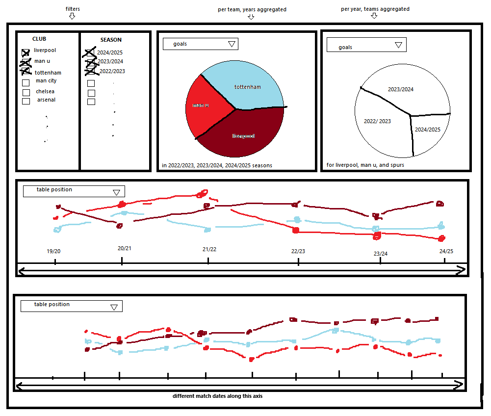

# DATA_551_PL_Dashboard

## DATA 551: Dataviz II - Project Repository - Premier League Dashboard

### Project Description

This dashboard will be based on 20 years of English Premier League data. At the top left, users will be able to filter (with checkboxes) on two columns: team and season. There will be two comparison charts (pie charts or bar charts) to the right of the filter lists, one that aggregates data by selected teams, and one by selected seasons. Below these panels will be two horizontal chronological line charts, one showing data by season (showing all 20 seasons) and one showing data by match date (showing only the seasons selected in the filter pane). All four of these visualizations will have drop-down menus to select various data to view. This data set has more than 150 columns, but we will start with implementing the most basic and essential information: goals and wins. If time allows we will add more data visualization options (for example, fouls and cards) to these dropdowns, add functionality (such as changing chart styles), and increase the scope of the data set. (Data for the other tiers of the English Football League are also available from the same source.)

